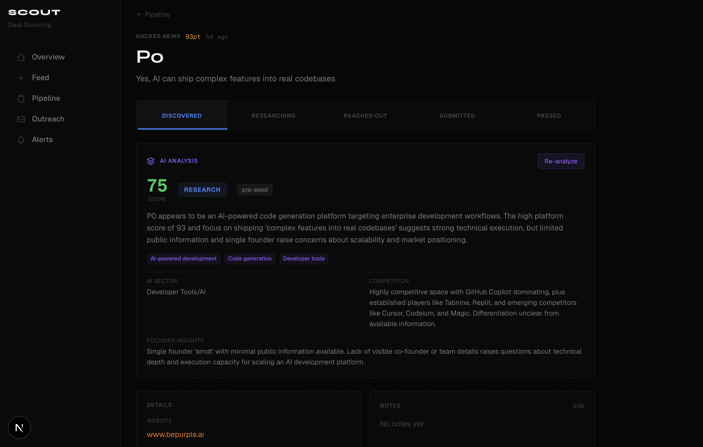

<p align="center">
  
</p>

<br />

<p align="center">
  <strong>VC Scout</strong>
</p>

<p align="center">
  AI-powered deal sourcing and pipeline management.<br/>
  One feed. Five sources. Instant AI scoring. Full pipeline tracking.
</p>

<p align="center">
  <a href="#features"><strong>Features</strong></a> &nbsp;&middot;&nbsp;
  <a href="#getting-started"><strong>Get Started</strong></a> &nbsp;&middot;&nbsp;
  <a href="#tech-stack"><strong>Stack</strong></a> &nbsp;&middot;&nbsp;
  <a href="#data-sources"><strong>Sources</strong></a>
</p>

<br />

<p align="center">
  
  
  
  
  
</p>

<br />

---

<br />

## Why

Deal flow is fragmented. Hacker News, Product Hunt, GitHub, Reddit, TechCrunch, Crunchbase — promising startups surface across all of them, and by the time you've checked every tab, opened every spreadsheet, and tried to remember who you emailed last week, the best deals are already gone.

I work in venture scouting and got tired of the workflow being the bottleneck. So I built VC Scout — a single command center that pulls every source into one feed, uses AI to score and rank deals automatically, and gives you a full Kanban pipeline to track startups from first discovery to final submission.

If you scout deals, this is for you.

<br />

---

<br />

## Features

**`Feed`** &nbsp; Pull startups from 5 sources in real-time. Filter by source. Search across everything. One unified view.

**`AI Scoring`** &nbsp; Batch-analyze your entire feed with one click. Every startup gets a 0–100 score, a one-line verdict, and auto-generated sector tags. Sort by AI score to find the diamonds.

**`AI Enrichment`** &nbsp; Go deep on any startup. Get a full research brief — competitive landscape, founder analysis, stage classification, and a clear recommendation: *pass*, *watch*, *research*, or *strong interest*.

**`Pipeline`** &nbsp; Kanban board with drag-and-drop. Move startups through **Discovered → Researching → Reached Out → Submitted → Passed**. Everything persists in a local SQLite database.

**`Outreach`** &nbsp; Track every touchpoint — emails, LinkedIn, intros, meetings. Filter by status. Never lose track of a conversation.

**`Alerts`** &nbsp; Define keyword and sector-based rules. Matching startups surface automatically. Stop searching, start getting notified.

<br />

---

<br />

## Getting Started

```bash
git clone https://github.com/aftab-s/vc-scout.git
cd vc-scout
pnpm install
```

```bash
cp .env.example .env.local
# Add your Anthropic API key
```

```bash
pnpm dev
```

Open **[localhost:3000](http://localhost:3000)** — the feed starts pulling startups immediately. No database setup needed — SQLite creates itself on first run.

<br />

### Environment Variables

| Variable | Required | Description |
|:---------|:---------|:------------|
| `ANTHROPIC_API_KEY` | Yes (for AI) | Powers scoring and enrichment |
| `PRODUCTHUNT_TOKEN` | No | PH API token — falls back to web scrape without it |

> **Note:** The app works without an API key — you just won't have AI scoring. The feed, pipeline, outreach, and alerts all work independently.

<br />

---

<br />

## Tech Stack

| | |
|:--|:--|
| **Framework** | Next.js 16 &middot; App Router &middot; React 19 &middot; Turbopack |
| **Language** | TypeScript 5 |
| **Styling** | Tailwind CSS 4 |
| **Database** | SQLite (WAL mode) via better-sqlite3 + Drizzle ORM |
| **AI** | Anthropic API |
| **Drag & Drop** | @hello-pangea/dnd |
| **Animations** | Motion |

<br />

---

<br />

## Data Sources

| Source | What it pulls | Auth |
|:-------|:-------------|:-----|
| **Hacker News** | "Show HN" posts, last 7 days | None |
| **Product Hunt** | Latest 50 products | None* |
| **GitHub** | Trending repos (>10 stars, created last 7 days) | None |
| **Reddit** | r/startups &middot; r/SaaS &middot; r/Entrepreneur &middot; r/indiehackers | None |
| **RSS** | TechCrunch &middot; Crunchbase News &middot; YC Blog | None |

<sub>*Optionally provide a Product Hunt API token for richer data. Without it, VC Scout scrapes the public page.</sub>

<br />

---

<br />

## Project Structure

```
src/
├── app/
│   ├── page.tsx                    # Dashboard
│   ├── feed/page.tsx               # Multi-source feed + AI scoring
│   ├── pipeline/page.tsx           # Kanban board
│   ├── outreach/page.tsx           # Outreach tracker
│   ├── alerts/page.tsx             # Alert rules
│   ├── startup/[id]/page.tsx       # Startup detail + AI enrichment
│   └── api/
│       ├── feed/route.ts           # Source aggregation
│       ├── startups/route.ts       # CRUD
│       ├── outreach/route.ts       # Outreach logging
│       ├── alerts/route.ts         # Alert rules
│       ├── stats/route.ts          # Dashboard stats
│       └── ai/
│           ├── analyze/route.ts    # Single startup enrichment
│           └── batch/route.ts      # Batch scoring
├── components/
│   └── sidebar.tsx
└── lib/
    ├── ai.ts                       # Scoring & enrichment logic
    ├── alerts.ts                   # Alert matching
    ├── db/
    │   ├── schema.ts               # 6 tables
    │   └── index.ts                # Connection + migrations
    └── sources/
        ├── hackernews.ts
        ├── producthunt.ts
        ├── github.ts
        ├── reddit.ts
        └── rss.ts
```

<br />

---

<br />

## License

MIT — do whatever you want with it.
